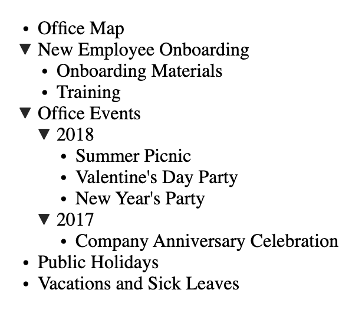

# Interview Question

Date: Aug 24, 2023
Company: Atlassian

it was asked in browser coding round and time allocated was 1 hour.

Question: develop below page in any framework/vanilla using the data coming from **page-data.js**

<details>
  <summary>Below is the content of javascript file</summary>
</details>

```js
const backendData = [
  { id: '1', name: 'Office Map' },
  {
    id: '2',
    name: 'New Employee Onboarding',
    children: [
      { id: '8', name: 'Onboarding Materials' },
      { id: '9', name: 'Training' },
    ],
  },
  {
    id: '3',
    name: 'Office Events',
    children: [
      {
        id: '6',
        name: '2018',
        children: [
          { id: '10', name: 'Summer Picnic' },
          { id: '11', name: "Valentine's Day Party" },
          { id: '12', name: "New Year's Party" },
        ],
      },
      { id: '7', name: '2017', children: [{ id: '13', name: 'Company Anniversary Celebration' }] },
    ],
  },
  { id: '4', name: 'Public Holidays' },
  { id: '5', name: 'Vacations and Sick Leaves' },
];

function fetchData() {
  return new Promise((resolve) => {
    setTimeout(resolve, 100, backendData);
  });
}
```


